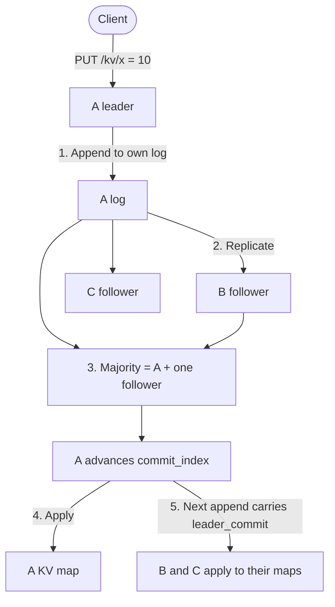

# Quasar

Quasar is a three-node replicated key-value store. Clients `PUT` / `DELETE` / `GET` keys. The cluster agrees on one ordered log of those operations and applies only **committed** entries to each node’s map.

Each node is the same process. Membership is `--peers`. On disk: leftover WAL (`data/<node-id>/log.jsonl`), term/vote (`raft.json`), and an optional snapshot (`snapshot.json`). The live commit index and KV map stay in memory.

## What it does

- **Leader election** — roles are follower, candidate, leader. Majority is two. Terms rise with each election; a higher term steps the old leader down.
- **Writes** — only the leader accepts `PUT`/`DELETE`. Followers return **409** and the leader URL. The leader appends to its log, replicates, commits when a majority has the entry, then applies to the map.
- **Catch-up** — a lagging follower gets the missing log suffix. If that suffix is gone (compacted), it gets a snapshot, then the leftover log.
- **Persistence** — restart reloads term, vote, snapshot (if any), then leftover WAL. Snapshot-covered keys are not replayed. Newer WAL waits for the leader’s `leader_commit`.
- **Linearizable `GET`** — followers **409**. The leader asks the others for a term/leadership ack, counts itself as one, and only then reads the committed map. No majority → reject, not a stale value.

Not a production database: no leases, no chunked snapshots, no automatic snapshot policy.

## Why a log, not just the map

Copying `x=10` onto every node is enough while everyone is up. It is not enough to agree on **order** or on **which writes are durable** after a failure.

The **log** is the history (`PUT` / `DELETE`) with a monotonic `index` and the **term** in which it was proposed. The **map** is derived from that history. A client `GET` reads the map, not the uncommitted tail of the log.

So a write is:

1. Record the operation on the leader’s log.
2. Copy that entry to the other nodes.
3. When a majority has it, mark it committed.
4. Apply committed entries, in index order, to each node’s map.

## Consensus in brief

Three voting members; **majority is two**. Leader + one live follower can commit. Two dead nodes cannot.

**Roles:** everyone starts as a follower. The leader heartbeats every 250ms. If a follower hears nothing for a randomized 0.8–1.6s, it becomes a candidate: increment term, vote for itself, ask the others. One vote per term, and only if the candidate’s log is at least as up-to-date. Two votes win.

## Replication and catch-up

`POST /internal/append` carries `prev_log_index` and `prev_log_term`. The follower accepts only if it has that exact prefix. The leader tracks `next_index` per follower; on reject it decrements and retries. If the follower is still behind the leader’s snapshot, the leader sends `POST /internal/install_snapshot`, then resumes append from `last_included_index + 1`. A conflicting uncommitted suffix is replaced. Committed entries are never deleted.

Followers set `commit_index = min(leader_commit, last log index)` and apply in order. `POST /snapshot` is local: write the applied map, drop that prefix from the WAL. Followers do not snapshot just because the leader did.

## Architecture

The leader is one of the three nodes, not a fourth process. Its own log is the first acknowledgement.



`GET` does not go through this write path. The leader confirms a majority still agrees on its term, then reads the committed map.

## Requirements

- Python 3.13+
- [uv](https://docs.astral.sh/uv/)

From the repository root:

```bash
uv sync --package quasar
```

## Run

Three processes, one terminal each, from the repository root:

```bash
PEERS='A=http://127.0.0.1:8001,B=http://127.0.0.1:8002,C=http://127.0.0.1:8003'

uv run --package quasar quasar --node-id A --port 8001 --peers "$PEERS"
uv run --package quasar quasar --node-id B --port 8002 --peers "$PEERS"
uv run --package quasar quasar --node-id C --port 8003 --peers "$PEERS"
```

Wait about two seconds for election. Stdout shows `candidate` / `granted vote` / `leader`.

| Flag | Default | Description |
| --- | --- | --- |
| `--node-id` | `A` | This process’s id |
| `--host` | `127.0.0.1` | Bind address |
| `--port` | `8000` | Bind port |
| `--peers` | (empty) | All nodes as `id=url`, comma-separated. Include this node; it is skipped locally. |
| `--data-dir` | `data/<node-id>` | This node’s data directory. A, B, and C must not share one. |

## Interactive lab

The lab is a visual debugger on the **same** three-node cluster. It does not implement another store or election. `quasar-lab` starts A, B, C on 8001–8003 (data under the system temp dir) and a site on port 9000.

```bash
uv run --package quasar quasar-lab
```

Open [http://127.0.0.1:9000](http://127.0.0.1:9000). Do not also start the three `quasar` commands above — same ports.

The page tells you the next click (gold **How** in the header, and “Do this now” under the nodes). First visit opens How. After that: **01 Election** → **Start** → **Step**.

`--host` and `--port` default to `127.0.0.1` and `9000`. Local only.

## API

| Method | Path | Description |
| --- | --- | --- |
| `GET` | `/health` | `role`, `term`, `leader`, `commit_index` |
| `GET` | `/log` | Leftover WAL plus `commit_index`, `snapshot_index`, `last_applied` |
| `PUT` | `/kv/{key}` | JSON body `{"value": "..."}` |
| `GET` | `/kv/{key}` | Linearizable read: leader only, after a majority confirms this term |
| `DELETE` | `/kv/{key}` | Delete a committed key |
| `POST` | `/snapshot` | Local snapshot of the applied map, then drop that WAL prefix |

Cluster RPC: `POST /internal/heartbeat`, `/internal/vote`, `/internal/append`, `/internal/install_snapshot`, `/internal/read_confirm`.

## Examples

Discover the leader:

```bash
for p in 8001 8002 8003; do echo -n "$p "; curl -s http://127.0.0.1:$p/health; echo; done
```

Write and read (leader on `8001`):

```bash
curl -s -X PUT http://127.0.0.1:8001/kv/x \
  -H 'Content-Type: application/json' \
  -d '{"value":"10"}'

curl -s http://127.0.0.1:8001/kv/x
curl -s http://127.0.0.1:8003/log
```

With one follower stopped, writes to the leader still commit. `GET` on a follower is **409**. If the leader is stopped, wait for a new election and send writes/reads to whoever `/health` reports as `leader`.

After restarting a follower, wait a second or two, then compare `/log` with the leader. `GET` only on the leader.

## Layout

```
projects/quasar/
├── README.md
├── pyproject.toml
└── src/quasar/
    ├── __init__.py    # node CLI
    ├── __main__.py
    ├── app.py         # cluster / KV backend
    └── lab/           # visual debugger (not part of the node)
        ├── __init__.py
        ├── cluster.py
        ├── server.py
        └── static/
```
