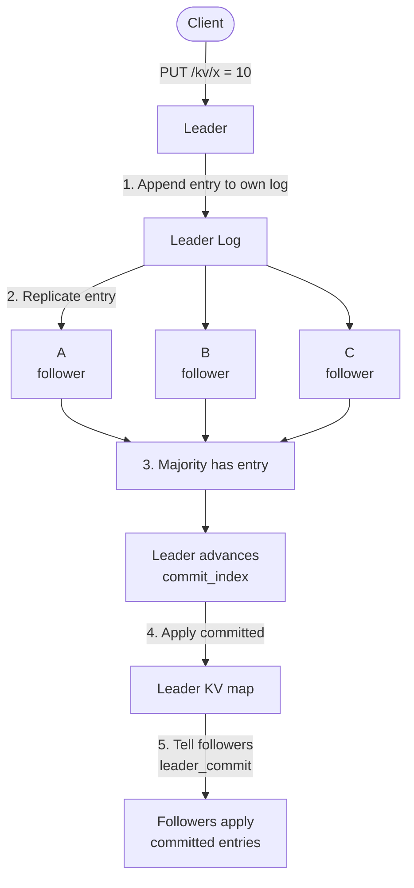

# Quasar

Quasar is a replicated key-value store. A cluster of nodes elects a leader, replicates an ordered log, and applies committed entries to a local key-value map.

Each node is the same FastAPI binary. Cluster membership is passed on the command line (`--peers`). The Raft log is an append-only WAL (`data/<node-id>/log.jsonl`). Term and vote are in `data/<node-id>/raft.json`. Commit index and the KV map are still in memory.

## Why a log, not just the map

Copying `x=10` onto every node is enough while everyone is up. It is not enough to agree on **order** or on **which writes are durable** after a failure.

The **log** is the history of operations (`PUT` / `DELETE`) with a monotonic `index` and the **term** in which they were proposed. The **map** is derived from that history: only entries that have been **committed** are applied. A client `GET` reads the map, not the uncommitted tail of the log.

So a write is not “update the dict and hope replicas match.” It is:

1. Record the operation on the leader’s log.
2. Copy that log entry to the others.
3. When a majority of the cluster has the entry, mark it committed.
4. Apply committed entries, in index order, to each node’s map.

A node that was down can be sent the log suffix it is missing and then apply up to `commit_index`, instead of being handed an opaque snapshot of the map with no notion of sequence.

## Consensus in brief

The cluster has three voting members; **majority is two**. The leader counts itself plus each follower that acknowledged the entry. Leader + one live follower is enough to commit; one dead node does not stall the cluster. Two dead nodes cannot form a majority, so those writes stay uncommitted and are not applied.

**Terms** increase with each election. A node that hears a higher term steps down (leader or candidate becomes follower). That prevents a stale leader from overriding a newer one after it reconnects.

**Roles:** follower, candidate, leader. Everyone starts as a follower. The leader heartbeats every 250ms. If a follower hears nothing for a randomized 0.8–1.6s, it becomes a candidate: it increments its term, votes for itself, and asks the others. A node grants at most one vote per term, and only if the candidate’s log is at least as up-to-date. Two votes win.

Writes go only to the current leader. Followers answer `PUT`/`DELETE` with **409** and the leader’s URL.

## Replication and catch-up

New entries are pushed with `POST /internal/append`. Each request carries `prev_log_index` and `prev_log_term`. The follower accepts only if it has that exact `(index, term)` prefix. A missing index or a different **entry term** at that index is a reject.

The leader tracks `next_index` per follower (initialized to `last_log_index + 1`). On reject it decrements `next_index` by one and retries until the prefix matches. If the follower is still behind the leader’s snapshot, those old entries no longer exist: the leader sends `POST /internal/install_snapshot` (one request with last included index/term and the KV map), then resumes AppendEntries from `last_included_index + 1`. Then, if an incoming entry collides at the same index with a different term, the follower deletes that entry and everything after it and appends the leader’s suffix. Committed entries are never deleted. Empty `entries` is a heartbeat: same prefix check, but a matching prefix does not strip a longer uncommitted tail.

Followers set `commit_index = min(leader_commit, last log index)` and apply newly committed entries in order.

A process restart reloads term, vote, snapshot (if any), then the leftover WAL. The snapshot restores the applied KV through `last_included_index`. Newer WAL entries wait for the leader’s `leader_commit` before they are applied. `POST /snapshot` writes the snapshot then drops that prefix from the WAL.

## Architecture

A client `PUT` is not applied to the map until a majority of the cluster has the log entry.



## Requirements

- Python 3.13+
- [uv](https://docs.astral.sh/uv/)

From the repository root:

```bash
uv sync --package quasar
```

## Run

Three processes, one terminal each, from the repository root:

```bash
PEERS='A=http://127.0.0.1:8001,B=http://127.0.0.1:8002,C=http://127.0.0.1:8003'

uv run --package quasar quasar --node-id A --port 8001 --peers "$PEERS"
uv run --package quasar quasar --node-id B --port 8002 --peers "$PEERS"
uv run --package quasar quasar --node-id C --port 8003 --peers "$PEERS"
```

Wait about two seconds for election. Stdout shows `candidate` / `granted vote` / `leader`.

| Flag | Default | Description |
| --- | --- | --- |
| `--node-id` | `A` | This process’s id |
| `--host` | `127.0.0.1` | Bind address |
| `--port` | `8000` | Bind port |
| `--peers` | (empty) | All nodes as `id=url`, comma-separated. Include this node; it is skipped locally. |
| `--data-dir` | `data/<node-id>` | This node’s WAL directory. A, B, and C must not share one. |

## Interactive lab

The lab is a visual debugger on top of the **same** three-node cluster. It does not implement another KV store or another election. `quasar-lab` starts the real `quasar` processes (A, B, C on 8001–8003, with isolated data under the system temp dir) and a site on port 9000.

```bash
uv run --package quasar quasar-lab
```

Open [http://127.0.0.1:9000](http://127.0.0.1:9000). Do not also start the three `quasar` commands in the Run section — they bind the same ports.

The page tells you the next click (gold **How** in the header, and “Do this now” under the nodes). First visit opens How. After that: click **01 Election** → **Start** → **Step**.

`--host` and `--port` default to `127.0.0.1` and `9000`. Local only.

## API

| Method | Path | Description |
| --- | --- | --- |
| `GET` | `/health` | `role`, `term`, `leader`, `commit_index` |
| `GET` | `/log` | Leftover WAL plus `commit_index`, `snapshot_index`, `last_applied` |
| `PUT` | `/kv/{key}` | JSON body `{"value": "..."}` |
| `GET` | `/kv/{key}` | Linearizable read: leader only, after a majority confirms this term; then the committed KV map |
| `DELETE` | `/kv/{key}` | Delete a committed key |
| `POST` | `/snapshot` | Write a local snapshot of the applied KV map, then drop that prefix from the WAL |

Cluster RPC: `POST /internal/heartbeat`, `/internal/vote`, `/internal/append`, `/internal/install_snapshot`, `/internal/read_confirm`.

## Examples

Discover the leader:

```bash
for p in 8001 8002 8003; do echo -n "$p "; curl -s http://127.0.0.1:$p/health; echo; done
```

Write and read (leader on `8001`):

```bash
curl -s -X PUT http://127.0.0.1:8001/kv/x \
  -H 'Content-Type: application/json' \
  -d '{"value":"10"}'

curl -s http://127.0.0.1:8001/kv/x
curl -s http://127.0.0.1:8003/log
```

With one follower stopped, writes to the leader still commit. If the leader is stopped, wait for a new election and write to the node `/health` reports as `leader`.

After restarting a follower, wait one or two seconds, then compare `/log` and `/kv/...` with the leader.

## Layout

```
projects/quasar/
├── README.md
├── pyproject.toml
└── src/quasar/
    ├── __init__.py    # node CLI
    ├── __main__.py
    ├── app.py         # cluster / KV backend
    └── lab/           # visual debugger (not part of the node)
        ├── __init__.py
        ├── cluster.py
        ├── server.py
        └── static/
```
