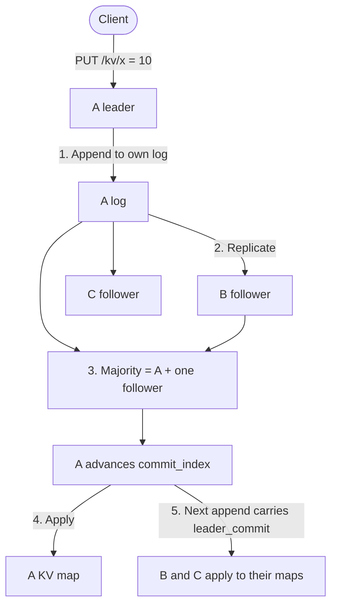
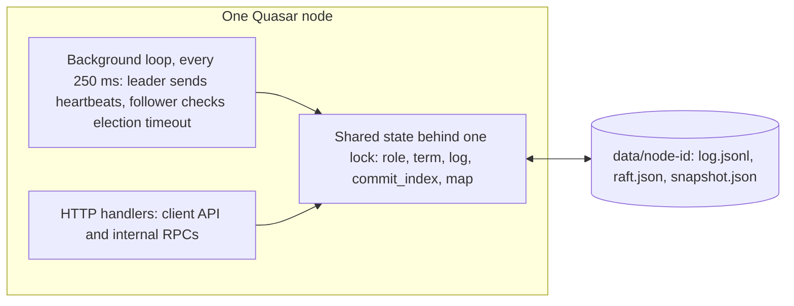
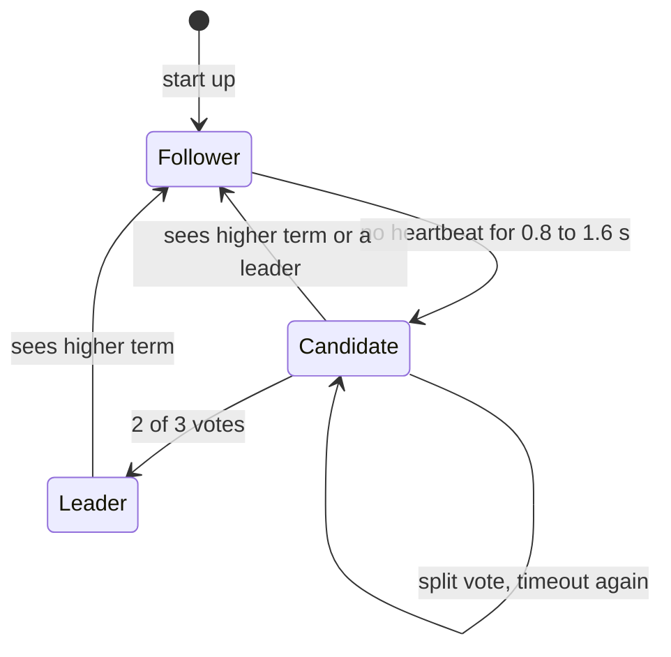
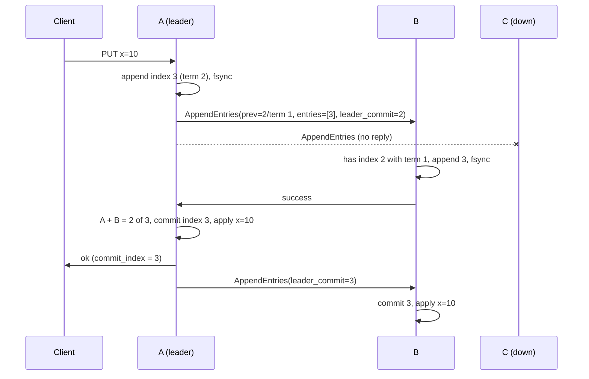
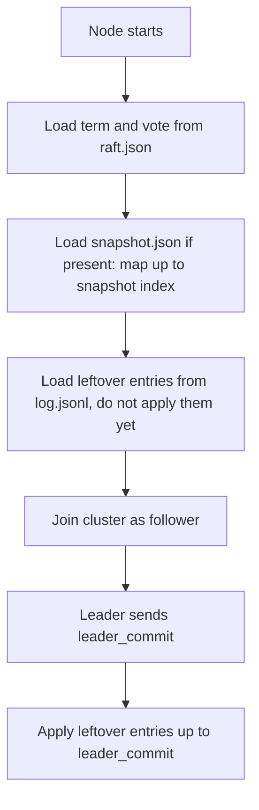
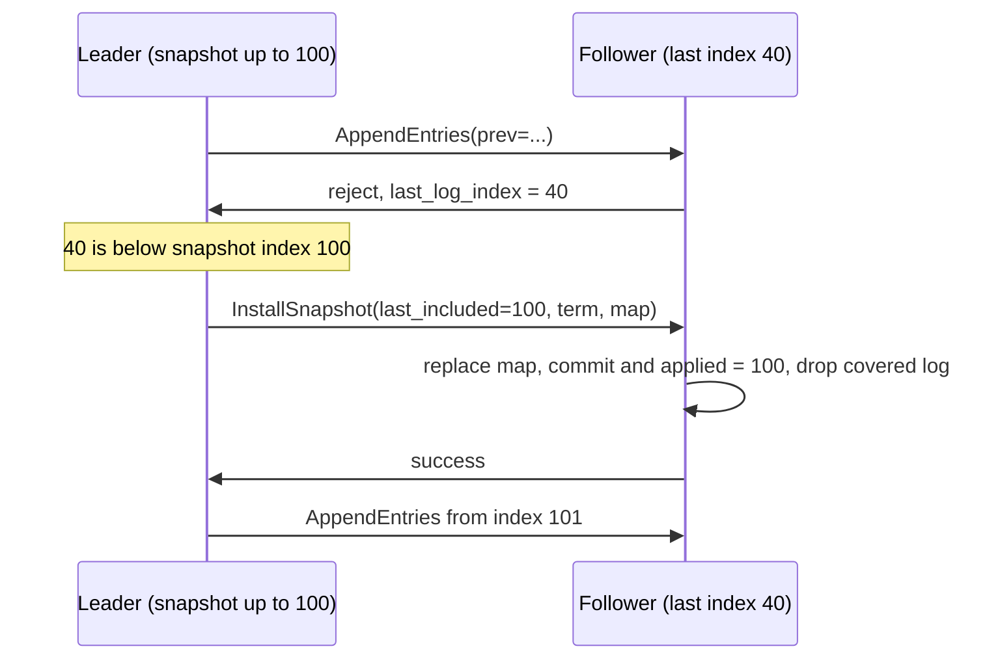
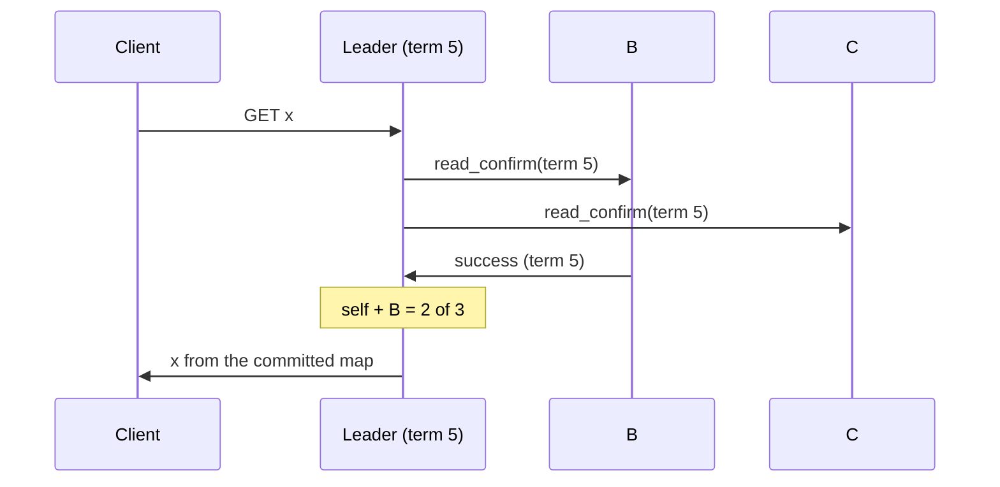

# Quasar

Quasar is a three-node replicated key-value store built on Raft. Clients `PUT`, `GET` and `DELETE` keys. The nodes elect a leader, agree on one ordered log of operations, and apply only **committed** entries to each node's map, so all three copies stay identical even when a node crashes or the network splits.

It was built to learn how replicated systems survive failures, one problem at a time: election, replication, conflict repair, durability, snapshots and consistent reads.

**What it implements**

- **Leader election** with terms, randomized timeouts and persisted votes
- **Log replication** with a prefix check, commit on majority, and apply in order
- **Conflict repair** for lagging or diverged followers (`next_index` back-off, uncommitted suffix replaced)
- **Durability**: fsync'd write-ahead log plus persisted term and vote
- **Snapshots and log compaction**, recovery from snapshot plus leftover log, and snapshot transfer to followers that fall too far behind
- **Linearizable reads**: the leader confirms its term with a majority before reading
- **Interactive lab**: a visual debugger that drives the real three nodes

Not a production database. See [Known limitations](#known-limitations-and-next-steps).

---

## Quick start

### Requirements

- Python 3.13+
- [uv](https://docs.astral.sh/uv/)

From the repository root:

```bash
uv sync --package quasar
```

### Run a cluster

Three processes, one terminal each, from the repository root:

```bash
PEERS='A=http://127.0.0.1:8001,B=http://127.0.0.1:8002,C=http://127.0.0.1:8003'

uv run --package quasar quasar --node-id A --port 8001 --peers "$PEERS"
uv run --package quasar quasar --node-id B --port 8002 --peers "$PEERS"
uv run --package quasar quasar --node-id C --port 8003 --peers "$PEERS"
```

Wait about two seconds for the election. Stdout shows `candidate`, `granted vote` and `leader`.

| Flag | Default | Description |
| --- | --- | --- |
| `--node-id` | `A` | This process's id |
| `--host` | `127.0.0.1` | Bind address |
| `--port` | `8000` | Bind port |
| `--peers` | (empty) | All nodes as `id=url`, comma-separated. Include this node; it is skipped locally. |
| `--data-dir` | `data/<node-id>` | This node's data directory. A, B and C must not share one. |

### Interactive lab

The lab is a visual debugger on the **same** three-node cluster. It does not implement a separate store or election. `quasar-lab` starts A, B and C on ports 8001–8003 (data under the system temp dir) and a site on port 9000.

```bash
uv run --package quasar quasar-lab
```

Open [http://127.0.0.1:9000](http://127.0.0.1:9000). Do not also start the three `quasar` commands above, since they use the same ports.

The page tells you the next click (gold **How** in the header, and "Do this now" under the nodes). The first visit opens How. After that: **01 Election** → **Start** → **Step**. `--host` and `--port` default to `127.0.0.1` and `9000`. Local only.

---

## API

| Method | Path | Description |
| --- | --- | --- |
| `GET` | `/health` | `role`, `term`, `leader`, `commit_index` |
| `GET` | `/log` | Leftover WAL plus `commit_index`, `snapshot_index`, `last_applied` |
| `PUT` | `/kv/{key}` | JSON body `{"value": "..."}`. Leader only |
| `GET` | `/kv/{key}` | Linearizable read. Leader only, after a majority confirms its term |
| `DELETE` | `/kv/{key}` | Delete a committed key. Leader only |
| `POST` | `/snapshot` | Local snapshot of the applied map, then drop that WAL prefix |

Followers answer client `PUT`, `GET` and `DELETE` with **409** and the leader's URL.

**Node-to-node RPCs** (HTTP + JSON):

| Endpoint | Raft name | Purpose |
| --- | --- | --- |
| `/internal/vote` | RequestVote | Ask for a vote in an election |
| `/internal/append` | AppendEntries | Replicate log entries. Also the heartbeat (empty entries) |
| `/internal/install_snapshot` | InstallSnapshot | Send a whole snapshot to a far-behind follower |
| `/internal/read_confirm` | read check | "Do you still accept me in this term?" before a read |
| `/internal/heartbeat` | (legacy) | Older heartbeat path, still applies `leader_commit` |

### Examples

Discover the leader:

```bash
for p in 8001 8002 8003; do echo -n "$p "; curl -s http://127.0.0.1:$p/health; echo; done
```

Write and read (leader on `8001`):

```bash
curl -s -X PUT http://127.0.0.1:8001/kv/x \
  -H 'Content-Type: application/json' \
  -d '{"value":"10"}'

curl -s http://127.0.0.1:8001/kv/x
curl -s http://127.0.0.1:8003/log
```

With one follower stopped, writes to the leader still commit. `GET` on a follower returns 409. If the leader is stopped, wait for a new election and send requests to whoever `/health` reports as `leader`. After restarting a follower, wait a second or two, then compare its `/log` with the leader's.

---

## Understanding Quasar

### The problem: keeping three copies identical

A key-value store on one server is simple, but if that server dies the data is unavailable or lost. So Quasar keeps **copies on three nodes**: if one dies, the other two keep working and nothing committed is lost.

The hard part is keeping the copies identical when a node crashes in the middle of a write, messages are lost or delayed, or the network splits the nodes into groups that can't talk.

Naive copying breaks quickly. One client sets `x=1` and another sets `x=2`. Node B receives them in the order 1, 2 and node C receives 2, 1. Now B has `x=2`, C has `x=1`, and the copies have diverged.

### Core ideas

**1. One leader decides the order.** All writes go through a single leader, so every node sees the same sequence. A follower that receives a write replies "not me" with the leader's address.

**2. Replicate a log of operations, not the values.** The leader keeps an ordered log. Each entry has an `index` (1, 2, 3, ...) and the `term` it was created in:

```
1 (term 1): PUT x = 1
2 (term 1): PUT y = 5
3 (term 2): DELETE x
```

Every node applies the same operations in the same order, so every node ends up with the same map. The map is just the result of replaying the log.

**3. An entry is committed once a majority stores it.** With three nodes, a majority is two (the leader itself plus one follower). A committed entry is permanent: it is never lost or undone. Waiting for a majority instead of all three keeps the cluster working with one node down, and since any two majorities overlap, a future leader always overlaps with a node that has every committed entry.

**4. Commit, then apply.** *Committed* means the entry is safe on a majority. *Applied* means it has been executed on a node's map. Nodes apply only committed entries, in index order, and reads look at the map, so clients never see a write that could still be undone.

**5. Three nodes tolerate one failure.** Tolerating `f` failures needs `2f + 1` nodes.

### Architecture

The leader is one of the three nodes, not a separate process. Its own log write counts as the first acknowledgement.


```mermaid
flowchart TB
    Client(["Client"]) -->|"PUT /kv/x = 10"| A["A leader"]

    A -->|"1. Append to own log"| ALog["A log"]

    ALog -->|"2. Replicate"| B["B follower"]
    ALog --> C["C follower"]

    ALog --> Majority["3. Majority = A + one follower"]
    B --> Majority

    Majority --> Commit["A advances commit_index"]
    Commit -->|"4. Apply"| AKV["A KV map"]
    Commit -->|"5. Next append carries leader_commit"| FApply["B and C apply to their maps"]
```

`GET` does not go through this write path. The leader confirms that a majority still accepts its term, then reads the committed map.

**Inside one node**

Every node runs the same code: a FastAPI server plus one background thread.


```mermaid
flowchart LR
    subgraph Node["One Quasar node"]
        HB["Background loop, every 250 ms: leader sends heartbeats, follower checks election timeout"]
        API["HTTP handlers: client API and internal RPCs"]
        State["Shared state behind one lock: role, term, log, commit_index, map"]
        HB --> State
        API --> State
    end
    Disk[("data/node-id: log.jsonl, raft.json, snapshot.json")]
    State <--> Disk
```

- **One global lock** protects all state. HTTP calls to other nodes happen **outside** the lock, so a slow or dead peer cannot freeze the node.
- The leader replicates to followers **in parallel**, so one unreachable follower does not delay the live one past its election timeout.

**State each node keeps**

| In memory | Meaning |
| --- | --- |
| `role` | follower, candidate or leader |
| `term` | current election term (only goes up) |
| `voted_for` | who this node voted for in the current term |
| `log` | log entries after any snapshot |
| `commit_index` | highest index known to be on a majority |
| `last_applied` | highest index already applied to the map |
| `store` | the key-value map |
| `next_index` | leader only: next log index to send each follower |
| `snapshot_index`, `snapshot_term` | the snapshot covers indexes up to here |

| On disk (`data/<node-id>/`) | Holds | Why |
| --- | --- | --- |
| `log.jsonl` | the log (WAL), one JSON line per entry, fsync'd | writes survive a crash |
| `raft.json` | `current_term`, `voted_for` | a restarted node cannot vote twice in one term |
| `snapshot.json` | compacted map plus last included index and term | the log does not grow forever |

`commit_index` and the map are **not** saved directly. After a restart, a node waits for the leader to tell it what is committed (this matches Raft, where the commit index is volatile). Log indexes are not list positions either: after a snapshot, the first entry in memory might be index 101.

### Leader election


```mermaid
stateDiagram-v2
    [*] --> Follower: start up
    Follower --> Candidate: no heartbeat for 0.8 to 1.6 s
    Candidate --> Leader: 2 of 3 votes
    Candidate --> Follower: sees higher term or a leader
    Candidate --> Candidate: split vote, timeout again
    Leader --> Follower: sees higher term
```

**Terms.** A term is an election number that only goes up. Each election starts a new term, and there is at most one leader per term. Every message carries the sender's term, and two rules handle the rest:

- A node that sees a **higher term** adopts it and becomes a follower. A leader that sees one steps down.
- A message with a **lower term** comes from a stale node and is rejected. The reply carries the newer term so the sender learns it is behind.

**Heartbeats and timeouts.** The leader sends a heartbeat (an AppendEntries with no new entries) every **250 ms**. A follower that hears nothing for a **random 0.8–1.6 s** assumes the leader is gone and starts an election.

**Starting an election.** The candidate increments its term, votes for itself, **saves term and vote to disk**, then sends RequestVote with its last log index and last log term. Two votes (itself plus one) make it leader, and it sends heartbeats immediately.

**Granting a vote.** A node grants its vote only if:

1. the candidate's term is not lower than its own
2. it has not voted for someone else in this term
3. the candidate's log is at least as up-to-date: compare the **last entry's term** first, then the **last index** if the terms are equal

The vote is saved to disk **before** the reply.

**Why each rule matters**

- **Majority:** any two majorities overlap in at least one node, and that node votes only once per term, so two leaders in one term are impossible.
- **Persisting the vote:** a node that votes for B, crashes and forgets could vote for C in the same term, giving two leaders.
- **Up-to-date check:** a committed entry is on a majority, and a winner needs a majority, so at least one voter has every committed entry and refuses a candidate that lacks it. A new leader therefore always has every committed entry.
- **Random timeout:** if two followers time out together, both vote for themselves and neither wins (a split vote). Randomizing makes one time out first.

**Example: the leader crashes**

| Time | What happens |
| --- | --- |
| 0 s | A (leader, term 1) crashes. Heartbeats stop |
| 0.9 s | B's timer fires first. B becomes candidate in term 2, votes for itself, persists, asks A and C |
| 0.9 s | A does not reply. C sees term 2, adopts it, checks B's log is up-to-date, grants and persists its vote |
| 0.9 s | B has 2 of 3 votes, becomes leader in term 2 and sends heartbeats |
| later | A restarts with term 1 from `raft.json`, receives B's term-2 heartbeat and becomes a follower |

**Partitions.** If A (leader) is cut off from B and C, the two of them elect a new leader in a higher term and keep working. A still believes it is leader but cannot commit anything without a majority. When the network heals, A sees the higher term and steps down.

### Write path: replicate, commit, apply

1. **The leader appends to its own log.** The entry gets `index = last index + 1` and the current term. It is fsync'd to the WAL first, then kept in memory.
2. **The leader sends AppendEntries to followers in parallel**, carrying the new entries, `prev_log_index` and `prev_log_term` (the entry just before them), `leader_commit`, and its term.
3. **A follower checks and stores.** It rejects a lower term. It rejects if it lacks an entry at `prev_log_index` with `prev_log_term` (repair is covered below). Otherwise it appends, fsyncs and replies success.
4. **The leader counts acks.** Itself plus one follower is a majority, so the entry is committed. The leader raises `commit_index`, applies the entry to its map and replies to the client.
5. **Followers learn the commit.** The leader immediately sends another AppendEntries, and every heartbeat also carries `leader_commit`. A follower sets `commit_index = min(leader_commit, its last log index)` and applies in order.


```mermaid
sequenceDiagram
    participant Cl as Client
    participant A as A (leader)
    participant B as B
    participant C as C (down)
    Cl->>A: PUT x=10
    A->>A: append index 3 (term 2), fsync
    A->>B: AppendEntries(prev=2/term 1, entries=[3], leader_commit=2)
    A--xC: AppendEntries (no reply)
    B->>B: has index 2 with term 1, append 3, fsync
    B->>A: success
    A->>A: A + B = 2 of 3, commit index 3, apply x=10
    A->>Cl: ok (commit_index = 3)
    A->>B: AppendEntries(leader_commit=3)
    B->>B: commit 3, apply x=10
```

C missed entry 3. When it returns, the leader catches it up.

**Committing index N also commits everything before N**, because logs only grow in order.

**Why the previous-entry check?** It keeps logs identical as a prefix. If a follower's entry at the previous index has the same term as the leader's, everything before it is identical too, because every earlier entry passed the same check. Without it, a follower with a gap or a different history would append blindly and diverge silently.

**When no majority is reachable**, the entry stays in the leader's log uncommitted and unapplied. The request still returns, but `commit_index` does not move past the entry. An uncommitted entry can later be discarded, which is safe because it was never reported as committed.

### Repairing lagging and diverged followers

A follower can be out of sync in two ways:

- **Lagging:** it is missing entries (it was down while they were added).
- **Diverged:** it holds uncommitted entries from an old leader that the current leader does not have.

Both are fixed the same way. **The leader never changes its own log; followers are made to match it.**

The leader keeps a `next_index` for each follower, starting optimistically at its own last index + 1.

1. Send AppendEntries with `prev = next_index − 1` and the entries from `next_index` on.
2. If the follower rejects, decrement `next_index` and retry.
3. Once they agree on the previous entry, the follower accepts: missing entries are appended, and any **conflicting** entry (same index, different term) is deleted from that point on and replaced with the leader's.

**Example: a diverged node rejoins**

```
B (leader, term 3):   1..7 same | 8 (term 3) PUT w=4
A (rejoining):        1..7 same | 8 (term 2) PUT z=9   (uncommitted)
```

| Try | B sends | A's check | Result |
| --- | --- | --- | --- |
| 1 | prev = 8 (term 3), no entries | A's entry 8 has term 2, not 3 | reject, B sets `next_index = 8` |
| 2 | prev = 7 (match), entries = [8 (term 3)] | index 8 conflicts (term 2 vs 3), not committed | A deletes its 8, appends B's 8, success |

**Why deleting is safe.** Committed entries are never deleted. The election rule guarantees the leader has every committed entry, so any entry that conflicts with the leader must be uncommitted. As an extra guard, a follower refuses to truncate an entry at or below its own commit index.

Each reject carries the follower's last log index. If that is below the leader's snapshot (the entries it needs were already compacted), the leader sends a snapshot instead.

### Persistence and recovery

| What | When it is written |
| --- | --- |
| Log entry (`log.jsonl`) | appended and fsync'd before the node acknowledges it |
| Term and vote (`raft.json`) | fsync'd before granting a vote, before starting an election, and when adopting a higher term |
| Snapshot (`snapshot.json`) | fsync'd before the covered log prefix is dropped |

- Files that are rewritten use **write to a temp file, fsync, then rename**, so a crash mid-write never leaves a half-written file.
- A half-written last line in the WAL after a crash is skipped on restart.
- **Why fsync before acking:** if a follower acknowledges entry 7 and then loses it in a crash, the leader may have counted a majority that no longer exists, and a committed entry could disappear.

**Restart sequence**


```mermaid
flowchart TD
    S["Node starts"] --> M["Load term and vote from raft.json"]
    M --> SN["Load snapshot.json if present: map up to snapshot index"]
    SN --> W["Load leftover entries from log.jsonl, do not apply them yet"]
    W --> J["Join cluster as follower"]
    J --> LC["Leader sends leader_commit"]
    LC --> AP["Apply leftover entries up to leader_commit"]
```

The leftover log is not replayed immediately because it may contain uncommitted entries that are about to be overwritten. Applying those would put wrong values in the map.

### Snapshots and log compaction

Without compaction, the log grows forever and restarts get slower.

**Taking a snapshot** (`POST /snapshot`, on any node, independently):

1. Save the map as of `last_applied`, plus the **last included index and term**, and fsync.
2. Only then drop those entries from the WAL.

The last included term is kept so the AppendEntries previous-entry check still works at the boundary, where that entry no longer exists in the log. Only applied (committed) state goes into a snapshot. Followers do not snapshot just because the leader did.

**InstallSnapshot.** If a follower needs entries the leader has already compacted, the leader sends its snapshot file instead:


```mermaid
sequenceDiagram
    participant L as Leader (snapshot up to 100)
    participant F as Follower (last index 40)
    L->>F: AppendEntries(prev=...)
    F->>L: reject, last_log_index = 40
    Note over L: 40 is below snapshot index 100
    L->>F: InstallSnapshot(last_included=100, term, map)
    F->>F: replace map, commit and applied = 100, drop covered log
    F->>L: success
    L->>F: AppendEntries from index 101
```

A snapshot older than or equal to the follower's own is ignored.

### Linearizable reads

A **linearizable** read always returns the latest committed value, as if there were only one copy. The danger is an old leader that has been cut off: it still thinks it is leader and could return a stale value.


```mermaid
sequenceDiagram
    participant Cl as Client
    participant L as Leader (term 5)
    participant B as B
    participant C as C
    Cl->>L: GET x
    L->>B: read_confirm(term 5)
    L->>C: read_confirm(term 5)
    B->>L: success (term 5)
    Note over L: self + B = 2 of 3
    L->>Cl: x from the committed map
```

1. `GET` works only on the leader. Followers return 409.
2. The leader asks the others in parallel whether they still accept it in this term.
3. It needs itself plus one confirmation. Otherwise it returns **503** instead of a possibly stale value. A reply with a higher term makes it step down.
4. It then reads from the committed map only.

**Why it works:** if a newer leader exists, a majority has moved to a higher term, so the old leader cannot collect a majority of confirmations.

**Cost:** one network round trip per read.

### Failure scenarios

| What fails | What happens |
| --- | --- |
| One follower crashes | Leader plus the other follower is a majority, so reads and writes continue. On restart it catches up through log repair or a snapshot |
| Leader crashes | A new leader is elected within about a second and has every committed entry. The old leader's uncommitted entries may be discarded |
| Two nodes down | No majority: no commits, no new leader, reads return 503. Quasar chooses consistency over availability |
| Partition, 1 node vs 2 | The two-node side elects a leader and keeps working. The isolated node cannot commit or serve reads. When the partition heals it steps down and its uncommitted entries are overwritten |
| Crash during a disk write | fsync, temp file plus rename, and skipping a half-written last line keep the files consistent |
| Two followers time out together | Split vote, then randomized timeouts let one win the next round |

---

## Known limitations and next steps

- **No no-op entry at the start of a term.** Raft has a new leader commit a no-op before serving reads. Without it, a newly elected leader may not yet know that the previous leader's last entry was committed, so for a short window a read can miss it, and old-term entries only become committed when the next client write commits on top of them.
- **Commit only advances on client writes.** There is no per-follower match tracking, so a follower that catches up later does not move `commit_index` until the next write.
- **`PUT` returns 200 even if the entry did not commit.** The response includes `commit_index` and `log_replication_failed`; the client has to check them.
- **Repair backs up one entry per round trip.** The follower already returns its last log index, which could be used to jump directly.
- **Snapshots are manual** (`POST /snapshot`) and sent whole in one request, with no chunking.
- **One round trip per read.** ReadIndex batching or leader leases would reduce this.
- **Fixed three-node membership.** No cluster reconfiguration.
- **Throughput.** One global lock and one fsync per entry. Batching fsyncs (group commit) and pipelining AppendEntries would raise throughput considerably.

---

## Layout

```
projects/quasar/
├── README.md
├── pyproject.toml
└── src/quasar/
    ├── __init__.py    # node CLI
    ├── __main__.py
    ├── app.py         # cluster / KV backend
    └── lab/           # visual debugger (not part of the node)
        ├── __init__.py
        ├── cluster.py
        ├── server.py
        └── static/
```